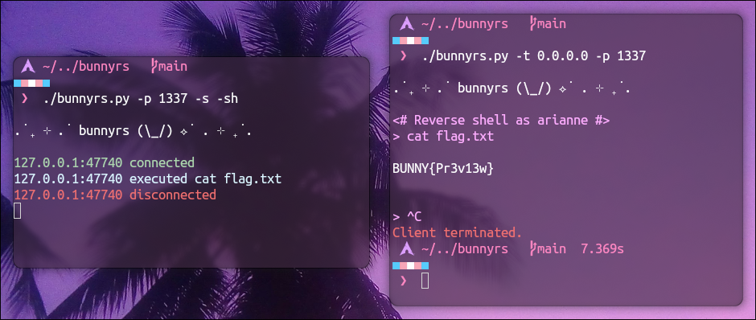
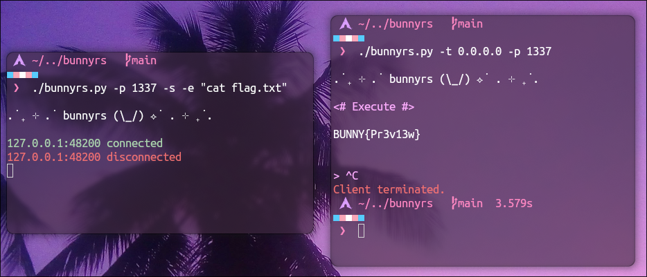

# . ݁₊ ⊹ . bunnyrs (\\_/) ⟡ ݁ . ⊹ ₊ ݁.

A Python reverse shell tool.

## Preview

### Reverse Shell

### Execute

## Usage

Can run in two modes: Client or Server

> [!NOTE] 
> Use CTRL+C to terminate bunnyrs in any mode.

### Server mode

To launch in server mode, use the `-s` flag. You must specify:

- A server profile, which can be:
  - Execute (`-e`) - on client connection: executes the specified command and sends the output.
  - Reverse Shell (`-sh`) - reverse shell available to connected clients.

- A port number with `-p`.

### Client mode

The client mode is the default mode.
You must specify a target IPv4 address (`-t`) and port number (`-p`)
